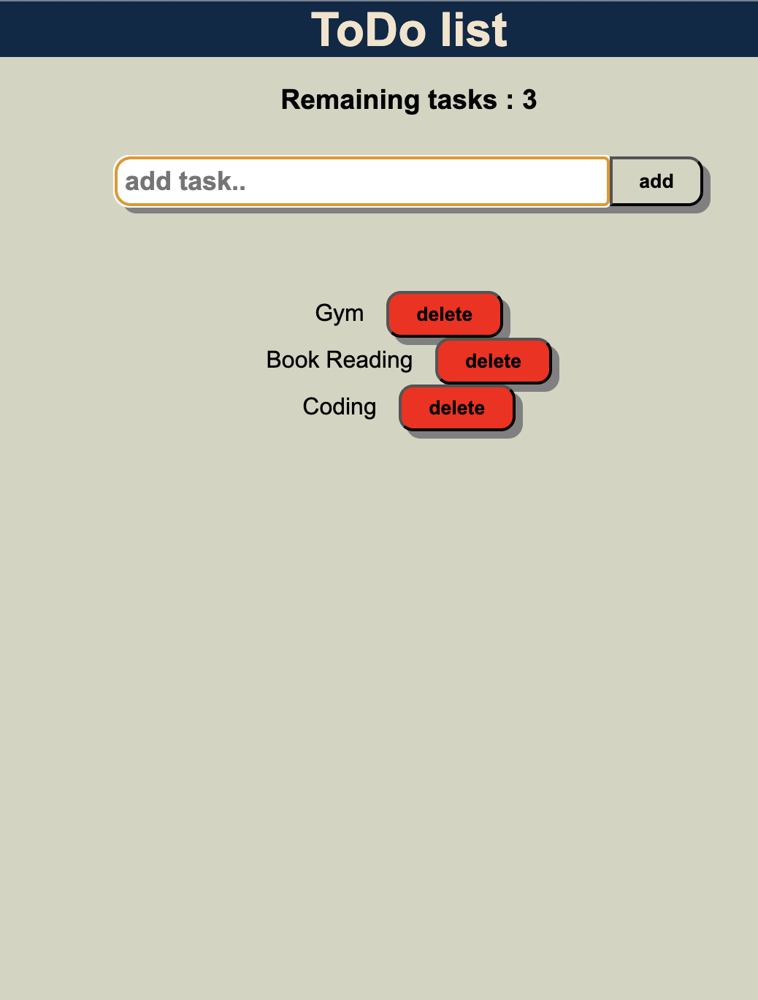

# 📝 To-Do List Web App

A responsive and interactive **To-Do List** application built with **HTML, CSS, and JavaScript**. This project helps users organize daily tasks efficiently by allowing them to add, complete, and delete tasks through a clean and user-friendly interface.

## 🚀 Live Demo

🔗 **https://to-do-list-lac-six-92.vercel.app**

---

## ✨ Features

* ➕ Add new tasks
* ✅ Mark tasks as completed
* 🗑️ Delete tasks
* 📱 Fully responsive design
* ⚡ Fast and lightweight
* 🎨 Clean and modern user interface
* 💻 Built using Vanilla JavaScript

---

## 🛠️ Technologies Used

* HTML5
* CSS3
* JavaScript (ES6)

---

## 📸 Preview



---

## 📂 Project Structure

```text
todo-list/
│── index.html
│── style.css
│── script.js
│── README.md
```

---

## 🚀 Getting Started

### Clone the Repository

```bash
git clone https://github.com/kuldeepsingh-1128/ToDo-list-.git
```

### Navigate to the Project

```bash
cd todo-list
```

### Run the Project

Open **index.html** in your browser.

---

## 🎯 Future Improvements

* 💾 Save tasks using Local Storage
* ✏️ Edit existing tasks
* 🔍 Search tasks
* 📅 Add due dates
* 🌙 Dark Mode
* 📊 Task progress tracker

---

## 🤝 Contributing

Contributions are welcome!

1. Fork the repository
2. Create a feature branch
3. Commit your changes
4. Push to your branch
5. Open a Pull Request

---

## 👨‍💻 Author

**Kuldeep**

B.Tech AI & DS Student

Passionate about Web Development, AI/ML, and Open Source.

---

## ⭐ Show Your Support

If you like this project, don't forget to **⭐ Star** the repository!
